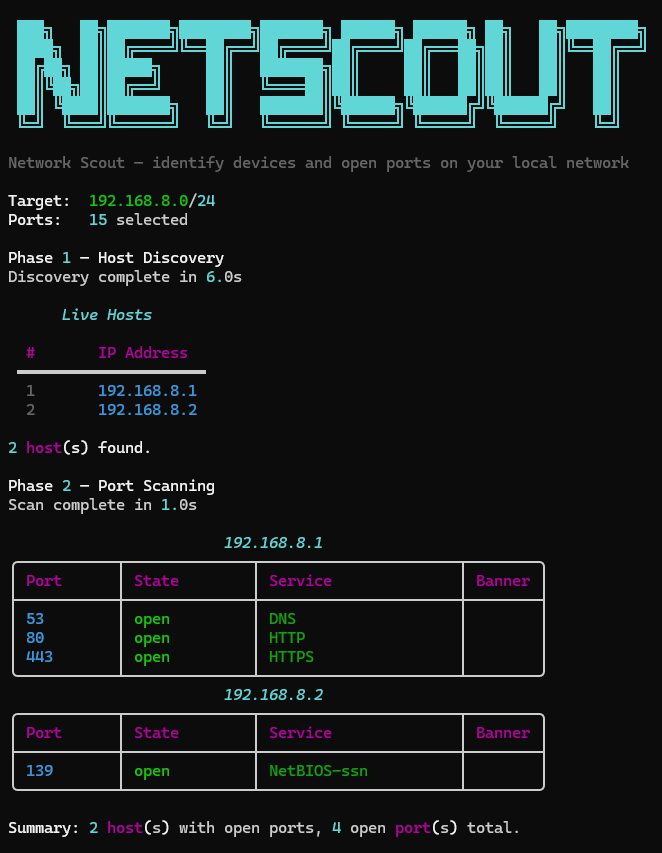

# netscout


A network scanner I built in Python to map out devices and open ports on a local network. You give it a subnet, it pings everything, then scans whatever responds.



---

## What it does

- Pings the whole subnet to find live devices
- Scans ports to see what's open (SSH, HTTP, RDP, etc.)
- Optionally grabs banners to identify what's actually running
- Shows results in a clean terminal table
- Can export to JSON or CSV if you need to save the output

---

## Setup

```bash
git clone https://github.com/iSeido/netscout.git
cd netscout
pip install -e .
```

This installs netscout as a command in your environment. Verify it works:

```bash
netscout --help
```

Only one dependency: `rich` (for the terminal output). Everything else is built into Python.

---

## Running it

```bash
# Basic scan of your local network
python netscout.py 192.168.1.0/24

# Scan more ports
python netscout.py 192.168.1.0/24 --top-ports 100

# Specific ports only
python netscout.py 192.168.1.0/24 -p 22,80,443,3389

# Full port range
python netscout.py 192.168.1.0/24 -p 1-1024

# Just find devices, don't scan ports
python netscout.py 192.168.1.0/24 --discover-only

# Single host, grab banners
python netscout.py 192.168.1.1 --banners

# Save output
python netscout.py 192.168.1.0/24 -o results.json
python netscout.py 192.168.1.0/24 -o results.csv
```

### Flags

| Flag | What it does | Default |
|------|-------------|---------|
| `-p` | Ports to scan — `80`, `22,80,443`, `1-1024` | — |
| `--top-ports N` | Scan top 20, 50, or 100 common ports | `20` |
| `--discover-only` | Ping sweep only, skip scanning | off |
| `--banners` | Try to read service banners | off |
| `--no-ping` | Skip discovery, scan host directly | off |
| `--timeout SEC` | How long to wait per connection | `1.0` |
| `--threads N` | Concurrent port scan threads | `100` |
| `--show-closed` | Show closed ports too | off |
| `-o FILE` | Export to `.json` or `.csv` | — |

---

## Usage Examples

```bash
# Show help
python netscout.py --help

# Discover hosts only (no port scan)
python netscout.py 192.168.1.0/24 --discover-only

# Scan top 50 common ports
python netscout.py 192.168.1.0/24 --top-ports 50

# Scan custom ports
python netscout.py 192.168.1.0/24 -p 22,80,443,3389

# Enable banner grabbing
python netscout.py 192.168.1.0/24 --banners

# Export results to JSON
python netscout.py 192.168.1.0/24 -o results.json

# Export results to CSV
python netscout.py 192.168.1.0/24 -o results.csv
```

---

## Project layout

```
netscout/
├── netscout.py           # entry point, CLI args
├── scanner/
│   ├── discovery.py      # ping sweep
│   ├── port_scanner.py   # TCP scanning
│   ├── service_info.py   # port → service name lookups
│   ├── banner.py         # banner grabbing
│   └── reporter.py       # terminal output + export
├── requirements.txt
└── setup.py
```

---

## Running Tests

Install dev dependencies and run pytest:

```bash
pip install -r requirements-dev.txt
pytest tests/
```

---

## Safety and Limitations

- **Authorized use only.** This tool is for educational purposes and networks you own or have explicit permission to test. Scanning unauthorized networks may be illegal.
- **ICMP dependency.** Host discovery relies on ping. Devices that block ICMP will not appear in results.
- **Not a Nmap replacement.** netscout covers common use cases but lacks the depth, accuracy, and feature set of Nmap.
- **Results may vary.** Firewalls, network segmentation, and OS-level filtering can affect scan accuracy and completeness.

---

## License

MIT — see [LICENSE](LICENSE) for details.

---

Made by [Ahmed Maghrabi](https://github.com/ahmadsufean)
